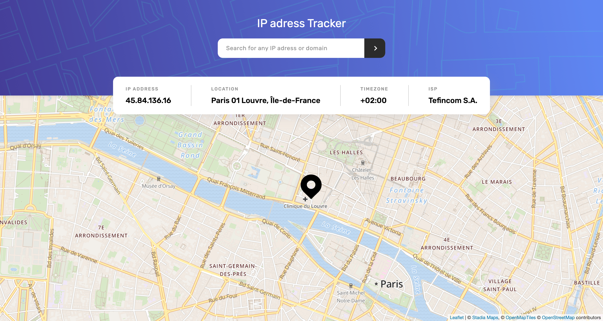

# Frontend Mentor - IP address tracker solution

This is a solution to the [IP address tracker challenge on Frontend Mentor](https://www.frontendmentor.io/challenges/ip-address-tracker-I8-0yYAH0). Frontend Mentor challenges help you improve your coding skills by building realistic projects.

## Table of contents

- [Overview](#overview)
  - [The challenge](#the-challenge)
  - [Screenshot](#screenshot)
  - [Links](#links)
- [My process](#my-process)
  - [Built with](#built-with)
  - [What I learned](#what-i-learned)
  - [Continued development](#continued-development)
  - [Useful resources](#useful-resources)
- [Author](#author)
- [Acknowledgments](#acknowledgments)

**Note: Delete this note and update the table of contents based on what sections you keep.**

## Overview

### The challenge

Users should be able to:

- View the optimal layout for each page depending on their device's screen size
- See hover states for all interactive elements on the page
- See their own IP address on the map on the initial page load
- Search for any IP addresses or domains and see the key information and location

### Screenshot

### Links

- Live Site URL: [Live site URL here](https://ip-address-tracker-pied-one.vercel.app/gi)

## My process

### Built with

- Semantic HTML5 markup
- CSS custom properties
- Flexbox
- Angular - JavaScript framework
- Leaflet - JavaScript library for interactive maps
- IP Geolocation API

### What I learned

During this project, I learned how to integrate an interactive map into an Angular application using the Leaflet library. I also gained experience in working with APIs to retrieve IP address and location data, as well as validating user input using regular expressions.

### Continued development

I plan to continue enhancing my skills in Angular development, including further exploration of Angular features, optimization techniques, and best practices. I also intend to improve my understanding of APIs and data handling.

### Useful resources

- [Angular Documentation](https://angular.io/docs) - Official documentation for the Angular framework.
- [Leaflet Documentation](https://leafletjs.com/reference-1.7.1.html) - Official documentation for the Leaflet library.
- [IP Geolocation API](https://geo.ipify.org/) - Official documentation for the Geolocation API.

## Author

- Frontend Mentor - [@Raf-Grt](https://www.frontendmentor.io/profile/Raf-Grt)

## Acknowledgments

I would like to acknowledge the Frontend Mentor community for providing this challenge and valuable feedback on my solution.
